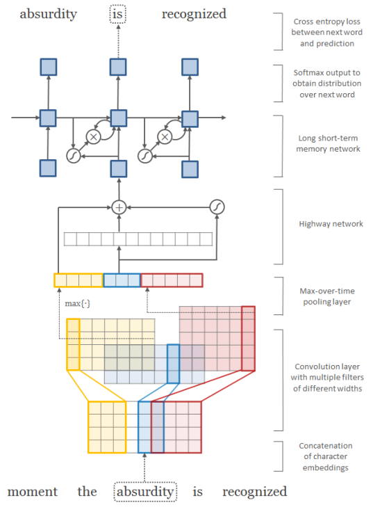

# lstm-charCNN-tf
======================================  
Tensorflow implementation of [Character-Aware Neural Language Models](http://arxiv.org/abs/1508.06615). The original code of author can be found [here](https://github.com/yoonkim/lstm-char-cnn). The code of this old version could be found [here](https://github.com/carpedm20/lstm-char-cnn-tensorflow)

Prerequisites
-------------

- Python 2.7 or Python 3.3+
- TensorFlow 1.0+
- cuda 8.0 and cuDNN 5.5 is better to train the model (optional)

Model  
------------  
  
Run  
-----  

To train a model with `ptb` dataset:

    $ python main.py --dataset ptb

To test an existing model:

    $ python main.py --dataset ptb --forward_only True
